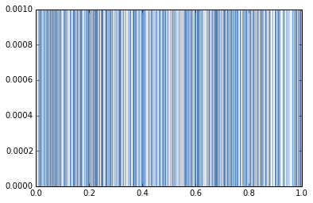

[Think Stats Chapter 4 Exercise 2](http://greenteapress.com/thinkstats2/html/thinkstats2005.html#toc41) (a random distribution)
```python
import random
import scipy.stats
t = [random.random() for _ in range(1000)]
pmf = thinkstats2.Pmf(t)
thinkplot.Pmf(pmf, linewidth=0.1)
thinkplot.Show()
````

> Assuming that the PMF doesn't work very well, try plotting the CDF instead

```python
cdf = thinkstats2.Cdf(t)
thinkplot.Cdf(cdf)
thinkplot.Show()
```


> Since the plot for cdf is more of a straight line,the distribution is uniform
